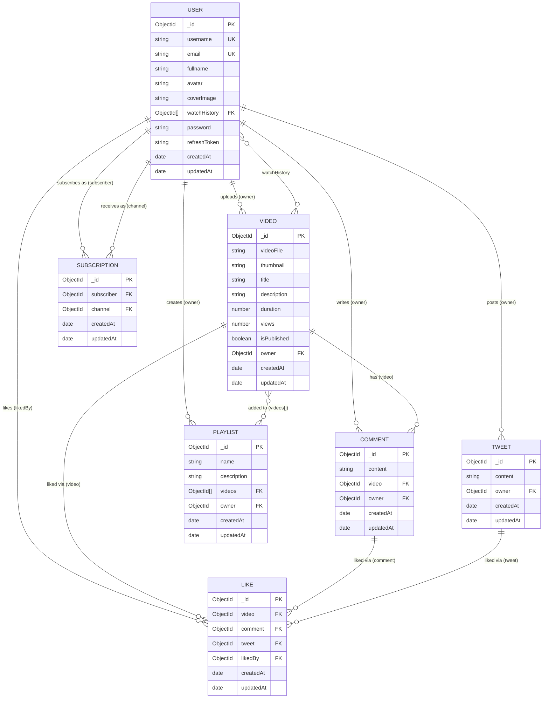

# 📊 ER Diagram — Video Sharing & Social Media Platform

> Generated from the Mongoose model definitions in `backend/src/models/`.

---

## 🗂️ Entity Summary

| Entity | Collection | Description |
|:---|:---|:---|
| **User** | `users` | Platform accounts — own videos, tweets, playlists |
| **Video** | `videos` | Uploaded videos with Cloudinary URL |
| **Comment** | `comments` | User comments on a video |
| **Tweet** | `tweets` | Short text posts by a user |
| **Like** | `likes` | Polymorphic like — targets a Video, Comment, or Tweet |
| **Playlist** | `playlists` | Named collection of videos owned by a user |
| **Subscription** | `subscriptions` | Maps a `subscriber` (User) → `channel` (User) |

---

## 🔗 Relationship Notes

- **Like is polymorphic**: A single `Like` document references exactly one of `video`, `comment`, or `tweet` — the other two fields are `null`.
- **Subscription is self-referential on User**: Both `subscriber` and `channel` are `ObjectId` references back to the `User` collection.
- **watchHistory** is an embedded array of `Video` ObjectId references stored directly on the `User` document.
- **Playlist → videos** is an embedded array of `Video` ObjectId references, allowing many videos per playlist.
